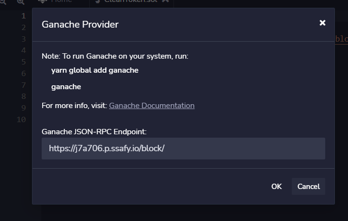
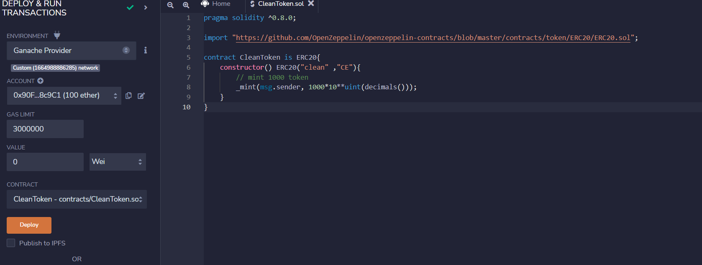

## 프로젝트 기술 스택 - 버전 및 툴

- BACKEND

  - IntelliJ IDEA 2022.2.1

  - SpringBoot 2.7.3

  - Java 8

  - openjdk version 15

  - JPA

  - OAuth 2

  - JJWT 0.9.1

  - Swagger 2 : 3.0.0

  - Gradle 7.5

  - MySQL 8.0.30 / MySQL Workbench 8.0

  - JVM 11.0.16 (Ubuntu 11.0.16+8-post-Ubuntu-0ubuntu120.04)

  - AWS EC2

  - AWS S3

  - Cert-Bot

  - Docker 20.10.18

  - Jenkins

    

- FRONTEND

  - VS Code 1.17.0
  - React 17.0.2
  - TypeScript 4.8.3
  - SCSS/HTML5
  - Node
  - NPM
  - Redux 4.2.0
  - ESLint 8.23.1
  - Material UI 5.10.5
  - NginX 1.18.0

  

- BLOCKCHAIN

  - Ganache
  - Web3 1.8.0
  - Web3js
  - Solidity


## NginX 설정

- EC2 환경에서 NginX 설치

  - `sudo apt-get install nginx`

- 설치 후 설정 변경

  - /etc/nginx/sites-available 경로 내 default 파일을 수정
  - 80 포트로 들어오면 443 포트로 return 시킨다 (http → https 로 자동 매핑)
  - 443 포트의 root 설정된 경로로 Jenkins가 빌드한 파일을 복사해서 넣어주는 형식
  - Ganache & IPFS 의 경우 CORS 문제 (http → https 송신 문제) 로 인해 NginX 설정으로 해결
  - default 파일 내용

  $$
  
  $$

  ```
  server {
  listen 80 default_server;
  listen [::]:80 default_server;
  
      root /var/www/html;
  
      index index.html index.htm index.nginx-debian.html;
  
      server_name j7a706.p.ssafy.io;
  
      location / {
              proxy_send_timeout 300;
              send_timeout 300;
              proxy_read_timeout 300s;
              proxy_connect_timeout 75s;
              return 301 https://$host$request_uri;
      }
  
  }
  
  server {
  listen 443 ssl;
  listen [::]:443 ssl;
  server_name j7a706.p.ssafy.io;
  
  ssl_certificate /etc/letsencrypt/live/j7a706.p.ssafy.io/fullchain.pem;
      ssl_certificate_key /etc/letsencrypt/live/j7a706.p.ssafy.io/privkey.pem;
      ssl_prefer_server_ciphers on;
  
      proxy_send_timeout 300;
      send_timeout 300;
      proxy_read_timeout 300s;
      proxy_connect_timeout 75s;
  
      location / {
              root   /home/ubuntu/html;
              index  index.html index.htm;
              try_files $uri $uri/ /index.html =404;
      }
  
      location /block/ {
              proxy_pass http://j7a706.p.ssafy.io:8545;
      }
  
      location /ipfs/ {
              proxy_pass http://$host:8085/$request_uri;
      }
  
  }
  
  ```

  

## SSL 인증서 발급 by Cert-Bot

- Certbot으로 SSL 인증서를 발급받기 위해선 NginX 가 선행으로 설치되어야함

  - 우분투 접속 후

    1. sudo apt update

       sudo apt upgrade 를 통해 apt 업그레이드 진행

    2. sudo apt install nginx 를 통해 NginX 설치

       설치 경로는 etc/nginx

       sudo service start nginx 를 통해 nginx 실행한 다음

       netstat -lntp 통해 80번 포트 리스닝 되는지 확인하고

       127.0.0.1 로 접속해서 구동 확인 - Welcome to nginx! 뜨면 성공!

  - Certbot 으로 SSL 인증서 발급

    1. sudo add-apt-repository ppa:certbot/certbot

       sudo apt-get install python-certbot-nginx 를 통해 certbot 설치

    2. sudo certbot --nginx -d j[7a706.p.ssafy.io](http://i7a402.p.ssafy.io/) 통해 도메인에 https 적용

    [[Ubuntu, Nginx\] Let's Encrypt로 https 적용하기](https://syudal.tistory.com/entry/Ubuntu-Nginx-Lets-Encrypt로-https-적용하기)

  - 발급받은 인증서를 이용해 PKC12 파일 생성 (Springboot 프로젝트 내 HTTPS 적용 시 필요)

    1. sudo su 를 통해 관리자 권한을 얻은 후 SSL 인증서 있는 경로로 이동

       ⇒ /etc/letsencrypt/live/i7a402.p.ssafy.io/

    2. openssl pkcs12 -export -in fullchain.pem -inkey privkey.pem -out keystore.p12 -name tomcat -CAfile chain.pem -caname root

       ⇒ pkc12 파일 생성 후 비밀번호 입력 (기억해둘것!)

    3. EC2 내 /home/ubuntu/ 위치에 위에서 생성한 pkc12 파일을 복사

## DOCKER 설치

- https://download.docker.com/linux/ubuntu/dists/

  접속 후 버전에 맞는 설치파일 받는다 (.deb)

- `sudo dpkg -i /path/to/package.deb` 를 통해 파일 설치

  [[Docker\] Ubuntu에 Docker 설치하기](https://dongle94.github.io/docker/docker-ubuntu-install/)

## DOCKER-COMPOSE 설치

- sudo curl -L https://github.com/docker/compose/releases/download/1.25.0-rc2/docker-compose-`uname -s`-`uname -m` -o /usr/local/bin/docker-compose

  - 명령어 입력을 통해 DOCKER-COMPOSE 설치

- sudo chmod +x /usr/local/bin/docker-compose

  - DOCKER-COMPOSE 에 권한 부여

- 이후 DOCKER-COMPOSE 를 통해 JENKINS / MYSQL / BACKEND 을 실행시킨다

  - MySQL 의 경우 /home/ubuntu/ 경로에 envs 폴더 생성 후 해당 폴더 내 mysqlenv 파일 생성한다

    - mysqlenv 파일 내용

      <aside> ⚙ MYSQL_ROOT_PASSWORD=tpxkrzmffhTm^^ MYSQL_DATABASE=bcssafy MYSQL_USER=bcssafy MYSQL_PASSWORD=bcssafy

      </aside>

  - /home/ubuntu/ 위치에 docker-compose.yml 파일 생성 후 아래와 같이 코드 작성

    - docker-compose.yml 파일 내용

      ```
      version: '3'
      
      services:
          jenkins:
              image: jenkins/jenkins:lts
              container_name: jenkins
              volumes:
                  - /var/run/docker.sock:/var/run/docker.sock
                  - /jenkins:/var/jenkins_home
              ports:
                  - "9090:8080"
              privileged: true
              user: root
          mysql:
            image: mysql
            container_name: mysql_service
            env_file:
              - ../ubuntu/envs/mysqlenv
            volumes:
              - ../volumes-mysql/mysql/:/var/lib/mysql/
            command: mysqld --character-set-server=utf8 --collation-server=utf8_general_ci
            ports:
              - "3306:3306"
          backend:
            image: zaq3102/setakcloth:lts
            container_name: setak_backend
            ports:
                  - "8080:8081"
          # frontend:
          #   image: zaq3102/setakcloth_react:lts
          #   container_name: setak_frontend
          #   ports:
          #         - "81:80"
          #         - "444:443"
      ```

## Jenkins 설정

- https://github.com/hjs101/CICD_manual

  - 가이드를 적극 참고해서 했다

  - BUT 가이드는 DID 방식을 사용했으나 해당 프로젝트는 DID 방식 X

  - 위의 가이드의

    - ***\*젠킨스와 연결된 gitlab 프로젝트로 도커 이미지 빌드하기\****

    - 의 ***\*Docker 설치\**** 까지 따라하자

    - 즉, DOCKER-COMPOSE 를 통해 Jenkins 를 실행시킨 후

      Jenkins 내 DOCKER 를 설치 하는 부분 까지 진행 (Docker Hub에 image 파일 PUSH 를 위해 설치)

- Front

  - EC2 환경에서 NginX 설정을 통해 80번 포트와 443번 포트에 대한 설정을 마친 뒤

  - Jenkins 를 활용해 React 프로젝트가 Build 된 산출물을 EC2 환경 내 위에서 설정한 위치에 복사해서 사용하는 방식

  - EC2 내 /home/ubuntu/envs/ 경로에 .env 파일을 미리 생성한 후 해당 .env 파일을 Jenkins 컨테이너 내 /var/jenkins_home/workspace/setakcloth/frontend 경로에 복사해놓아야 함

    - docker cp /home/ubuntu/envs/.env jenkins:/var/jenkins_home/privatefiles

      → Jenkins 컨테이너로 .env 파일 복사하는 명령어

    - .env  파일 내용

      ```
      # 배포 시
      REACT_APP_SERVER_URL = "<https://j7a706.p.ssafy.io:8080>"
      REACT_APP_CLIENT_URL = "<https://j7a706.p.ssafy.io>"
      REACT_APP_KAKAO_API_JS = "카카오 API 키 입력"
      REACT_APP_KAKAO_API_REST = "카카오 API 키 입력"
      REACT_APP_ETH_URL = "<https://j7a706.p.ssafy.io/block/>"
      ```

- Back

  - Docker Hub 활용

  - Back 프로젝트 내 dockerfile 을 이용해 docker image 파일을 생성하고

  - 해당 파일을 Docker Hub 에 Push

    - Docker Hub 의 경우 알아서 만들어서 설정 매핑 해주자

  - 이후 EC2 환경에서 해당 docker image 파일을 PULL 받아

  - DOCKER-COMPOSE 를 통해 실행시킨다

  - EC2 내 /home/ubuntu/ 경로에 application.properties 파일을 미리 생성한 후 해당 application.properties 파일을 Jenkins 컨테이너 내 /var/jenkins_home/workspace/setakcloth/backend 경로에 복사해놓아야 함

    - docker cp /home/ubuntu/application.properties jenkins:/var/jenkins_home/privatefiles

      → Jenkins 컨테이너로 application.properties 파일 복사하는 명령어

    - [application.properties](http://application.properties) 파일 내용 ( 중요 정보는 직접 수정해야 한다 )

      ```
      # Server
      build.date=@build.date@
      server.port=8081
      # Charset of HTTP requests and responses. Added to the "Content-Type" header if not set explicitly.
      server.servlet.encoding.charset=UTF-8
      # Enable http encoding support.
      server.servlet.encoding.enabled=true
      # Force the encoding to the configured charset on HTTP requests and responses.
      server.servlet.encoding.force=true
      
      # Database
      spring.jpa.hibernate.naming.implicit-strategy=org.springframework.boot.orm.jpa.hibernate.SpringImplicitNamingStrategy
      spring.jpa.hibernate.naming.physical-strategy=org.springframework.boot.orm.jpa.hibernate.SpringPhysicalNamingStrategy
      spring.jpa.hibernate.ddl-auto=update
      spring.jpa.generate-ddl=true
      spring.jpa.properties.hibernate.dialect=org.hibernate.dialect.MySQL57Dialect
      spring.data.web.pageable.one-indexed-parameters=true
      spring.datasource.url=jdbc:mysql://j7a706.p.ssafy.io:3306/bcssafy?serverTimezone=Asia/Seoul&allowPublicKeyRetrieval=true&useSSL=false&characterEncoding=utf8
      spring.datasource.username=사용자이름
      spring.datasource.password=사용자비밀번호
      spring.datasource.driver-class-name=com.mysql.cj.jdbc.Driver
      spring.datasource.maximum-pool-size=5
      
      #spring.datasource.hikari.connectionTimeout=30000
      #spring.datasource.hikari.maximumPoolSize=5
      #spring.datasource.hikari.prepStmtCacheSize=250
      #spring.datasource.hikari.prepStmtCacheSqlLimit=2048
      #spring.datasource.hikari.cachePrepStmts=true
      #spring.datasource.hikari.useServerPrepStmts=true
      #spring.datasource.hikari.useLocalSessionState=true
      #spring.datasource.hikari.useLocalTransactionState=true
      #spring.datasource.hikari.rewriteBatchedStatements=true
      #spring.datasource.hikari.cacheResultSetMetadata=true
      #spring.datasource.hikari.cacheServerConfiguration=true
      #spring.datasource.hikari.elideSetAutoCommits=true
      #spring.datasource.hikari.maintainTimeStats=false
      
      # LOGGING
      logging.level.org.springframework.web=ERROR
      logging.level.com.ecommerce=DEBUG
      
      # Logging pattern for the console
      logging.pattern.console=%d{HH:mm:ss} %clr(%5p) [%c] %m%n
      
      # Logging pattern for file
      logging.pattern.file=%d{yyyy-MM-dd HH:mm:ss} [%thread] %-5level %logger{36} - %msg%n
      logging.file = logs/backend.log
      
      # Ethereum Client
      spring.web3j.client-address=http://127.0.0.1:8545
      spring.web3j.admin-client=true
      
      # Ethereum CA & EOA
      eth.encrypted.password=이더리움비밀번호
      eth.erc20.contract=0xcDcedAcea55DB472060042C644096DF65B9d9849
      eth.purchase.record.contract=0x0c2BC3cAB0036D1E51734B4D6e6cb8BCB046A2C7
      eth.admin.address=3dc5f23f3be9037a9485bc45337d2ed26b4b8a71
      eth.admin.wallet.filename=admin.wallet
      
      # Swagger
      springfox.documentation.swagger.use-model-v3=false
      spring.mvc.pathmatch.matching-strategy=ant_path_matcher
      
      # Salt
      SALT=thfxmsmsqhrdjwl
      
      # Amazon S3 Account Credentials
      cloud.aws.credentials.access-key=AWS access 키 값
      cloud.aws.credentials.secret-key=AWS secret 키 값
      
      # Amazon S3 bucket Info
      cloud.aws.s3.bucket=setakcloth
      cloud.aws.region.static=ap-northeast-2
      cloud.aws.stack.auto=false
      
      # AWS S3 Bucket URL
      cloud.aws.s3.bucket.url=https://setakcloth.s3.ap-northeast-2.amazonaws.com
      
      # file size
      spring.servlet.multipart.max-file-size=20MB
      spring.servlet.multipart.max-request-size=20MB
      
      # EC2
      logging.level.com.amazonaws.util.EC2MetadataUtils: error
      
      # Kakao developers
      kakao.client.id=카카오 아이디 값
      kakao.client.secret=카카오 secret 값
      
      # URL
      client.url=https://j7a706.p.ssafy.io
      
      server.ssl.key-store=classpath:keystore.p12
      server.ssl.key-store-type=PKCS12
      server.ssl.key-store-password=SSL 인증서 비밀번호
      server.http2.enabled=true
      ```

      

- Jenkins 내 shell 코드

  - Build Steps 의 Execute shell

    → Docker Compose로 실행된 Jenkins 컨테이너 내에서 실행되는 구문

    ```
    
    ⚙ docker image prune -a --force
    cd /var/jenkins_home/workspace/setakcloth/frontend
    cp /var/jenkins_home/privatefiles/.env /var/jenkins_home/workspace/setakcloth/frontend
    npm install
    npm run build
    
    cd /var/jenkins_home/workspace/setakcloth/backend/src/main/resources
    cp /var/jenkins_home/privatefiles/application.properties /var/jenkins_home/workspace/setakcloth/backend/src/main/resources
    cp /var/jenkins_home/privatefiles/keystore.p12 /var/jenkins_home/workspace/setakcloth/backend/src/main/resources
    
    cd /var/jenkins_home/workspace/setakcloth/backend/
    docker build . -t zaq3102/setakcloth:lts
    docker login -u zaq3102 --password 비밀번호입력 [docker.io](http://docker.io/)
    docker push zaq3102/setakcloth:lts
    
    ```
  
    
  
    - 개인정보가 들어있는 파일을 shell 코드를 통해 복사하기 위해 위 코드처럼 사용
  
  - 빌드 후 조치 의 Transfers 의 Exec command
  
    → Build Step 진행 후 EC2 환경에서 실행되는 구문
  
    ```
    
    echo "Action After Build Start"
    sudo rm /home/ubuntu/html/index.html
    docker cp jenkins:/var/jenkins_home/workspace/setakcloth/frontend/dist/index.html /home/ubuntu/html/index.html
    sudo rm /home/ubuntu/html/main.js
    docker cp jenkins:/var/jenkins_home/workspace/setakcloth/frontend/dist/main.js /home/ubuntu/html/main.js
    
    sudo docker login -u zaq3102 --password 비밀번호입력 [docker.io](http://docker.io/)
    sudo docker pull zaq3102/setakcloth:lts
    
    sudo docker-compose up -d
    echo "Run testproject spring react"
    
    
    ```
    
    

## MySQL 설정

1. sudo docker exec -it mysql_service bash  ⇒  도커에 실행중인 MySQL 접속
2. mysql -u root -p   엔터 후 위에서 입력한 비밀번호 입력해서 MySQL root 계정 접속
   1. use mysql; ⇒ select user, host from user;   ⇒ 유저 정보 확인
   2. CREATE USER 'bcssafy'@'%' IDENTIFIED BY '비밀번호';   ⇒ 유저 만든다
   3. GRANT ALL PRIVILEGES ON *.* TO 'bcssafy'@'%';   ⇒ 앞에서 만든 회원에게 권한 부여
3. 이후 로컬 환경에서 워크벤치 실행 후 아래 사진처럼 설정해준다
   1. Connection Name : 임의 설정
   2. Connection Method : Standard(TCP/IP) ⇒ 기본값
   3. Hostname : j[7a706.p.ssafy.io](http://i7a402.p.ssafy.io) ⇒ 가상서버 호스트네임
   4. Port : 3306 ⇒ MYSQL 기본 포트
   5. Username : ssafy ⇒ 아까 만든 유저 이름
   6. Password : 비밀번호 ⇒ 아까 만든 비밀번호

입력 후 TestConnection 해보자

**** 만약 안된다면 도커에 실행중인 MySQL 에 접속해서 restart 해보자 ****

## Ganache 설정

- Docker를 이용해 간단하게 구축한다
- sudo docker run --detach --publish 8545:8545 trufflesuite/ganache-cli:latest --accounts 1 -g 0 --debug

## IPFS 설정

- 역시나 Docker를 이용해 간단하게 구축한다

- sudo docker run -d --name ipfs_host -v $ipfs_staging:/export -v $ipfs_data:/data/ipfs -p 4001:4001 -p 4001:4001/udp -p 0.0.0.0:8085:8080 -p 0.0.0.0:5001:5001 ipfs/kubo:latest

- ERC20 Token 설정

  - [blockchain 폴더](./../blockchain)에 있는 CleanToken.sol 파일을 

    https://remix.ethereum.org/  을 이용해 컴파일

    

  - 컴파일 후 ENVIRONMENT Ganache Provicder 에 Ganache 접속 주소를 적어 접속

    

  - MASTER_ADDR 을 선택한 후 CleanToken을 Deploy 한다

    

    

  - walletService 파일 에 MASTER_ADDR 과 CONTRATCT_ADDRESS 의 값을 생성된 MASTER_ADDR 와 CONTRATCT_ADDRESS로 변경해준다

    
